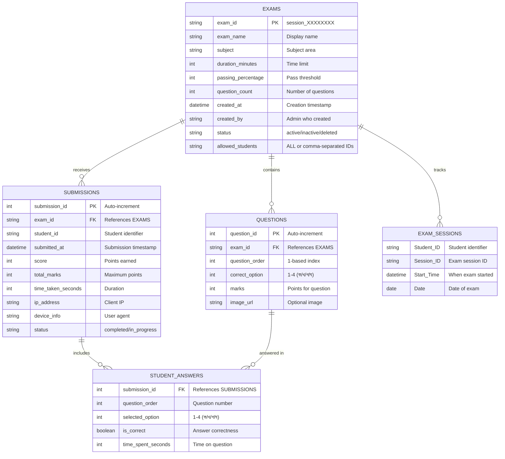

# MCQ System - CSV Database Schema

## Overview
This document provides a comprehensive overview of the CSV-based relational database structure for the MCQ (Multiple Choice Question) examination system.

## Database Architecture

The system uses CSV files as a lightweight database with the following characteristics:
- **Primary Tables**: Core normalized tables (exams, questions, submissions, student_answers)
- **Legacy Tables**: Session-specific files (answers/, answer_keys/, sessions/)
- **Backup Tables**: Old format backup (csv_backup_old_format/)

---

## Entity-Relationship Diagram



---

## Table Schemas

### 1. **exams.csv** (Primary Table)
**Purpose**: Master table storing all exam metadata

| Column | Type | Description | Example |
|--------|------|-------------|---------|
| exam_id | string (PK) | Unique identifier for exam | session_079bc94e |
| exam_name | string | Display name of exam | Physics Mid-term 2024 |
| subject | string | Subject category | Physics, Mathematics |
| duration_minutes | int | Time limit for exam | 25, 60, 120 |
| passing_percentage | int | Minimum % to pass | 40, 60, 70 |
| question_count | int | Number of questions | 10, 20, 50 |
| created_at | datetime | Creation timestamp | 2025-11-01 00:00:00 |
| created_by | string | Admin who created | admin |
| status | string | Exam status | active, inactive, deleted |
| allowed_students | string | Whitelist (ALL or IDs) | ALL, STU001,STU002 |

**Relationships**:
- One exam → Many questions (1:N)
- One exam → Many submissions (1:N)
- One exam → Many exam sessions (1:N)

**Business Rules**:
- exam_id format: `session_` + 8-character hex
- When allowed_students = "ALL", everyone can take exam
- status = "active" means exam is available
- duration_minutes determines countdown timer

---

### 2. **questions.csv** (Primary Table)
**Purpose**: Stores individual questions and correct answers for each exam

| Column | Type | Description | Example |
|--------|------|-------------|---------|
| question_id | int (PK) | Auto-increment unique ID | 1, 2, 3 |
| exam_id | string (FK) | Links to exams.csv | session_079bc94e |
| question_order | int | Position in exam (1-based) | 1, 2, 3, 4 |
| correct_option | int | Correct answer (1-4) | 1=ক, 2=খ, 3=গ, 4=ঘ |
| marks | int | Points for this question | 1, 2, 5 |
| image_url | string | Optional question image | https://... |

**Relationships**:
- Many questions → One exam (N:1)
- One question → Many student answers (1:N)

**Business Rules**:
- correct_option: 1=ক (Option A), 2=খ (Option B), 3=গ (Option C), 4=ঘ (Option D)
- question_order starts at 1 and increments sequentially
- marks typically = 1 for all questions in an exam
- image_url is optional (empty string if no image)

**Note**: Question text is stored as compiled PDF files in `sessions/{exam_id}/output/snippet_{question_order}.pdf`

---

### 3. **submissions.csv** (Primary Table)
**Purpose**: Records each student's exam submission with overall score

| Column | Type | Description | Example |
|--------|------|-------------|---------|
| submission_id | int (PK) | Auto-increment unique ID | 1, 2, 3 |
| exam_id | string (FK) | Links to exams.csv | session_079bc94e |
| student_id | string | Student identifier | STU001, guest |
| submitted_at | datetime | Submission timestamp | 2025-11-07 17:35:58 |
| score | int | Points earned | 8, 15, 20 |
| total_marks | int | Maximum possible points | 10, 20, 25 |
| time_taken_seconds | int | Duration of exam | 900, 1200 |
| ip_address | string | Client IP address | 192.168.1.1 |
| device_info | string | User agent string | Mozilla/5.0... |
| status | string | Submission status | completed, in_progress |

**Relationships**:
- Many submissions → One exam (N:1)
- One submission → Many student answers (1:N)

**Business Rules**:
- One student can only submit one attempt per exam
- Percentage = (score / total_marks) * 100
- Pass/Fail determined by comparing percentage to exam.passing_percentage
- time_taken_seconds should be ≤ exam.duration_minutes * 60

**Calculated Fields**:
- Percentage: (score / total_marks) * 100
- Pass Status: percentage >= exam.passing_percentage

---

### 4. **student_answers.csv** (Primary Table)
**Purpose**: Stores individual question responses for each submission

| Column | Type | Description | Example |
|--------|------|-------------|---------|
| submission_id | int (FK) | Links to submissions.csv | 1, 2, 3 |
| question_order | int | Question number (1-based) | 1, 2, 3, 4 |
| selected_option | int | Student's answer (1-4) | 1=ক, 2=খ, 3=গ, 4=ঘ |
| is_correct | boolean | Answer correctness | true, false |
| time_spent_seconds | int | Time on this question | 30, 45, 60 |

**Relationships**:
- Many student answers → One submission (N:1)
- Many student answers → One question (N:1)

**Business Rules**:
- Composite key: (submission_id, question_order)
- is_correct determined by comparing selected_option to questions.correct_option
- selected_option: 1=ক, 2=খ, 3=গ, 4=ঘ (Bengali MCQ options)

---

### 5. **sessions/exam_sessions.csv** (Legacy Table)
**Purpose**: Tracks when students start exams (login/session tracking)

| Column | Type | Description | Example |
|--------|------|-------------|---------|
| Student_ID | string | Student identifier | STU001, 23, guest |
| Session_ID | string | Exam session ID | session_079bc94e |
| Start_Time | datetime | When exam was started | 2025-11-07 17:35:48 |
| Date | date | Date of exam | 2025-11-07 |

**Business Rules**:
- Records when student clicks "Start Exam"
- Used for audit trail and timing verification
- Does not necessarily mean exam was submitted

---

### 6. **answer_keys/** (Legacy Files)
**Purpose**: Stores answer key string for each exam session

**File Naming**: `answer_key_session_{exam_id}.csv`

**Structure**:
| Column | Type | Description | Example |
|--------|------|-------------|---------|
| Session_ID | string | Exam identifier | session_079bc94e |
| Answer_Key | string | Concatenated correct answers | 11234, 1423 |

**Format**:
- Answer_Key is a string of digits 1-4
- Position in string = question number
- Digit value = correct option (1=ক, 2=খ, 3=গ, 4=ঘ)
- Example: "1423" means Q1=ক, Q2=ঘ, Q3=খ, Q4=গ

**Relationship**: This duplicates data from questions.csv but in denormalized format

---

### 7. **answers/** (Legacy Files)
**Purpose**: Stores student responses for each exam session

**File Naming**: `answers_session_{exam_id}.csv`

**Structure**:
| Column | Type | Description |
|--------|------|-------------|
| Student_ID | string | Student identifier |
| Session_ID | string | Exam identifier |
| Timestamp | datetime | Submission time |
| Marks | int | Score earned |
| Total | int | Maximum points |
| Q1, Q2, Q3... | string | Answers in Bengali (ক/খ/গ/ঘ) |

**Format**:
- Dynamic columns: Q1, Q2, Q3... based on question count
- Answers stored as Bengali characters: ক (1), খ (2), গ (3), ঘ (4)
- Example row: `STU001, session_079bc94e, 2025-11-07 17:35:58, 8, 10, ক, খ, গ, ক`

**Relationship**: This duplicates data from submissions.csv and student_answers.csv

---

## Data Flow

### Exam Creation Flow
```
Admin creates exam
    ↓
1. Generate exam_id (session_XXXXXXXX)
2. Compile LaTeX questions → PDF files
3. Insert into exams.csv
4. Insert questions into questions.csv
5. Create answer_key file (legacy)
```

### Student Taking Exam Flow
```
Student starts exam
    ↓
1. Check allowed_students whitelist
2. Record in exam_sessions.csv
3. Display questions from PDFs
4. Student submits answers
    ↓
5. Calculate score
6. Insert into submissions.csv
7. Insert answers into student_answers.csv
8. Write to answers/ file (legacy)
9. Display result
```

### Grading Logic
```python
for each question:
    if student_answer == correct_option:
        score += question.marks
        is_correct = true
    else:
        is_correct = false

percentage = (score / total_marks) * 100
pass_status = percentage >= exam.passing_percentage
```

---

## File System Structure

```
web/
├── exams.csv                          # Primary: All exams
├── questions.csv                      # Primary: All questions
├── submissions.csv                    # Primary: All submissions
├── student_answers.csv                # Primary: Detailed answers
├── sessions/
│   └── exam_sessions.csv              # Legacy: Session tracking
├── answer_keys/
│   └── answer_key_session_*.csv       # Legacy: Answer keys
├── answers/
│   └── answers_session_*.csv          # Legacy: Student answers
└── sessions/{exam_id}/
    ├── input/
    │   └── snippet_*.tex              # LaTeX source files
    └── output/
        └── snippet_*.pdf              # Compiled question PDFs
```

---

## Data Integrity Rules

### Primary Keys
- `exams.exam_id`: Unique identifier (session_XXXXXXXX format)
- `questions.question_id`: Auto-increment integer
- `submissions.submission_id`: Auto-increment integer
- `student_answers.(submission_id, question_order)`: Composite key

### Foreign Keys
- `questions.exam_id` → `exams.exam_id`
- `submissions.exam_id` → `exams.exam_id`
- `student_answers.submission_id` → `submissions.submission_id`

### Constraints
1. **One submission per student per exam**: A student cannot submit the same exam twice
2. **Question order sequential**: question_order must be 1, 2, 3, ... N without gaps
3. **Answer validation**: selected_option and correct_option must be 1-4 only
4. **Score consistency**: SUM(student_answers.is_correct * questions.marks) = submissions.score
5. **Question count match**: questions.question_count = COUNT(questions WHERE exam_id)

---

## Migration Notes

The system has **two data formats** due to historical evolution:

### Old Format (Legacy)
- Session-specific files in `answers/` and `answer_keys/`
- Bengali characters for answers (ক/খ/গ/ঘ)
- Denormalized structure
- Used before November 2025

### New Format (Current)
- Normalized CSV tables (exams, questions, submissions, student_answers)
- Integer values for options (1-4)
- Proper relational structure
- Used from November 2025 onwards

**Both formats currently coexist** for backward compatibility. The application writes to both.

---

## Indexing Strategy (if migrating to SQL)

If this CSV database is migrated to a proper SQL database, recommended indexes:

```sql
-- Primary tables
CREATE INDEX idx_questions_exam ON questions(exam_id);
CREATE INDEX idx_submissions_exam ON submissions(exam_id);
CREATE INDEX idx_submissions_student ON submissions(student_id);
CREATE INDEX idx_student_answers_submission ON student_answers(submission_id);

-- Composite indexes
CREATE INDEX idx_submissions_exam_student ON submissions(exam_id, student_id);
CREATE INDEX idx_questions_exam_order ON questions(exam_id, question_order);

-- Search indexes
CREATE INDEX idx_exams_status ON exams(status);
CREATE INDEX idx_exams_created ON exams(created_at DESC);
```

---

## Query Examples

### Get all active exams
```
Filter exams.csv WHERE status = 'active'
```

### Get questions for an exam
```
Filter questions.csv WHERE exam_id = 'session_079bc94e'
ORDER BY question_order ASC
```

### Get student's submission for an exam
```
Filter submissions.csv WHERE exam_id = 'session_079bc94e' AND student_id = 'STU001'
```

### Get detailed answers for a submission
```
1. Get submission_id from submissions.csv
2. Filter student_answers.csv WHERE submission_id = X
3. JOIN with questions.csv ON question_order to get correct answers
```

### Calculate exam statistics
```
1. Filter submissions.csv WHERE exam_id = 'session_079bc94e'
2. Calculate:
   - Average score: AVG(score / total_marks * 100)
   - Pass rate: COUNT(score >= passing_percentage) / COUNT(*)
   - Completion rate: COUNT(status = 'completed') / COUNT(*)
```

---

## Data Volumes (Estimated)

| Table | Rows per Exam | Total (100 Exams, 50 Students) |
|-------|---------------|--------------------------------|
| exams.csv | 1 | 100 rows |
| questions.csv | 20 | 2,000 rows |
| submissions.csv | 50 | 5,000 rows |
| student_answers.csv | 1,000 (20×50) | 100,000 rows |
| exam_sessions.csv | 50 | 5,000 rows |

**Storage estimates**:
- CSV files: ~10-20 MB for 100 exams
- PDF files: ~50-100 MB (20 questions × 100 exams × ~50 KB/PDF)
- Total: ~60-120 MB for full system

---

## Security Considerations

1. **No encryption**: CSV files are plain text
2. **File permissions**: Web server must have read/write access
3. **Concurrent writes**: CSV files are not transaction-safe
4. **Backup strategy**: Regular backups of entire `web/` directory recommended
5. **Data validation**: Application layer must validate all inputs
6. **Student ID verification**: No password authentication in current design

---

## Backup and Recovery

### Current Backup
- `csv_backup_old_format/`: Contains backup of legacy format files

### Recommended Strategy
1. Daily backup of entire `web/` directory
2. Version control for CSV files (Git)
3. Periodic export to SQL database for long-term storage
4. Backup before each exam session creation

---

## Future Improvements

1. **Migrate to SQLite/PostgreSQL** for better data integrity
2. **Add authentication table** for student password management
3. **Add audit log table** for tracking all changes
4. **Implement soft deletes** instead of hard deletes
5. **Add question bank table** for reusable questions
6. **Add exam templates** for quick exam creation
7. **Add analytics tables** for reporting (exam performance, student progress)

---

## Summary

This CSV-based database provides a **lightweight, file-based relational structure** for the MCQ examination system. While it lacks the robustness of a proper RDBMS, it offers:

**Advantages**:
- Simple deployment (no database server required)
- Easy to inspect and debug (plain text files)
- Version control friendly
- Low resource requirements

**Disadvantages**:
- No transaction support
- Limited concurrent access
- No referential integrity enforcement
- Manual backup required
- Scalability concerns for large datasets

The schema is well-normalized and ready for migration to a proper database system when needed.
